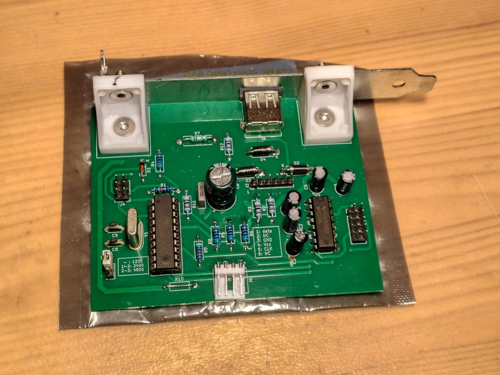
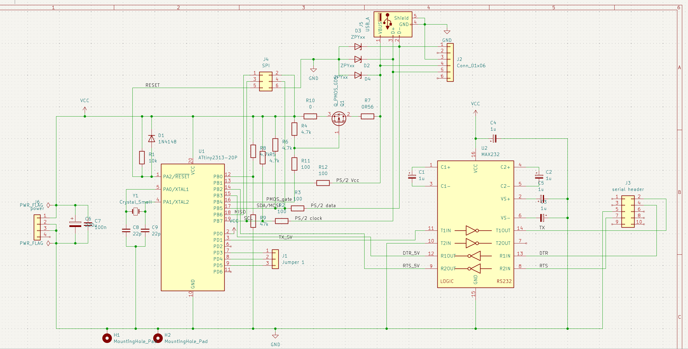

# PS2toSerial
PS/2 to serial converter using ATtiny2313 and MAX232. There are plenty of similar projects, but almost all of them are external, so here's my internal version
which draws power from floppy power connector.

## Description

This does essentially the same thing as other PS/2 to serial adapters: it interfaces with PS/2 mouse, and pretends to be a serial mouse to the computer.

It has following features:
* Support for normal 1200 baud serial, or 9600 baud high speed mode
* Support for wheel mouse in high speed mode
* Sample rate is selected from 40/100/200 with a jumper. For higher than 40, 9600 baud serial is needed.
* USB A connector, so no need for a passive USB->PS/2 -adapter
* Header for PS/2 connector is also provided
* Supports hotplugging
* Crystal oscillator for ensuring accurate baud rate
* TVS diodes for ESD protection
* Overcurrent protection using ATtiny2313's onboard analog comparator and a P-type MOSFET as a switch
* No SMD components, so it's easy to assemble
* Programming via SPI header

Jumper J1 sets the sample rate. When it's open, 40 samples per second is used at default 1200 baud serial speed. In this mode mouse wheel is ignored,
as that would require dropping sample rate to horrible 20 per second. When jumper is set to 1-2 or 2-3, 100 or 200 samples/s and 9600 baud serial speed
are used.

Using 9600 baud serial speed requires modified mouse drivers, which can be found for example from this project:
https://github.com/LimeProgramming/USB-serial-mouse-adapter/tree/main

Note that there's no standard PS/2 header pinout, so if you use that always check that your PS/2 back panel matches the pinout!

## Technical details

ATtiny has both hardware USART and Universal Serial Interface or USI, which is readily adaptable to PS/2, so there's only minimal need for bit banging. USI provides 
start condition detector with interrupt and counter (increased at PS/2's clock rising and falling edge) overflow interrupt, which removes need for polling. Instead
of sampling data on falling clock edge, this adapter uses rising edge as all the devices I have measured change data line state closer to falling than rising edge.
In particular, with a KVM switch this was within as little as 3µs from falling edge!

Resistors R8 and R9 form voltage divider for analog comparator positive input pin. R7 is used as a shunt resistor for current detection, voltage after it goes to
comparator's negative input pin. Comparator's output is monitored by interrupt from timer 0 every 100µs, and if there's overcurrent for 1ms, power to PS/2 is shut down.

RTS and DTR signals to pins PB2 and PB3 are monitored with pin change interrupt. When either of them goes down and then back up, mouse detection characters are sent if
mouse is connected.

Normally PS/2 host doesn't know whether mouse is disconnected or is just still, so the adapter polls mouse by sending command enable data reporting or 0xF4 every two
seconds. If mouse is connected, it replys with an ACK or 0xFA, if it's disconnected, there's no clock signal which is detected.

